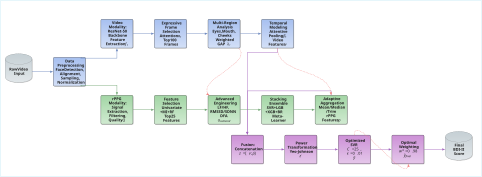
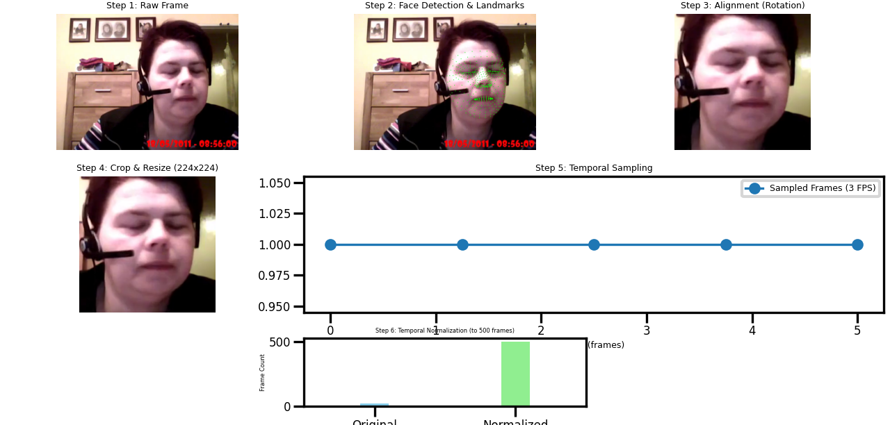
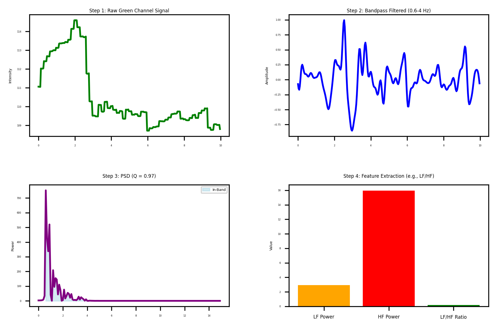
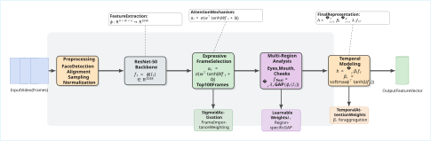
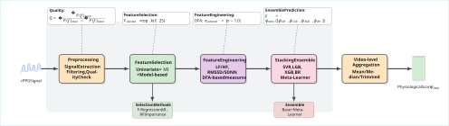
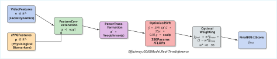
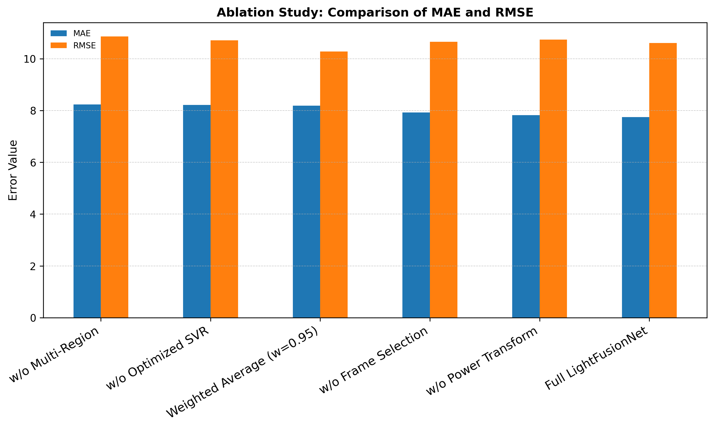
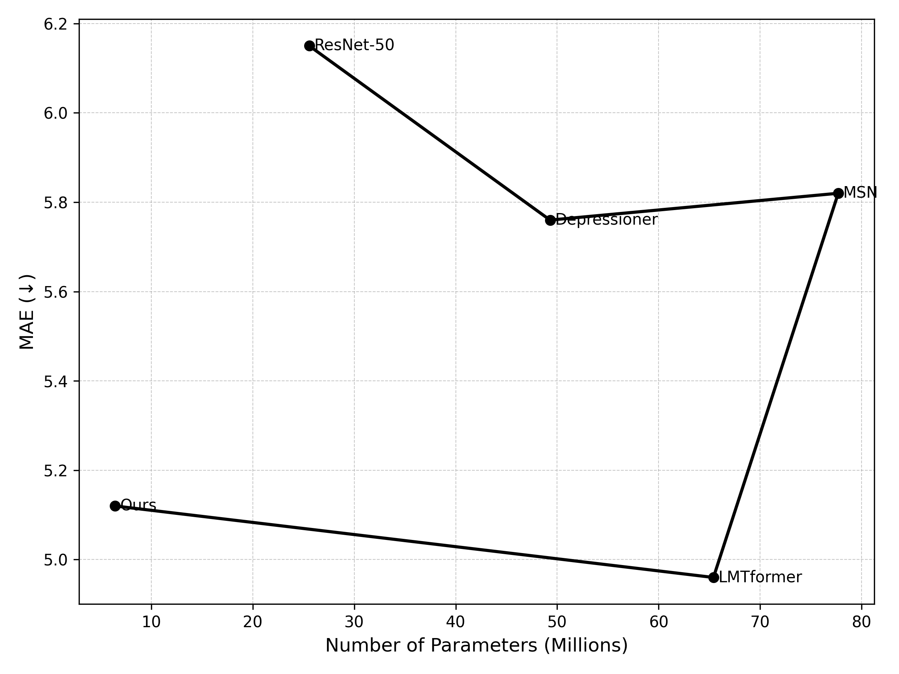

# LightFusionNet: A Lightweight Multimodal Fusion Framework for Depression Severity Estimation

---

## Overview
**LightFusionNet** is a novel lightweight multimodal framework that combines **facial dynamics** and **remote photoplethysmography (rPPG)** signals for automated **depression severity estimation**.  
This research addresses the critical need for objective, reliable, and scalable methods in mental health assessment, particularly for depression detection.

> 🔬 **Research Status:** This project is currently under review for publication.  
> The code will be released upon acceptance.

---

## Key Contributions
- First ML-based multimodal framework integrating **rPPG** and **facial features** for depression assessment on **AVEC 2014**.  
- Extremely lightweight design — **350 parameters, 350 FLOPs**.  
- Comprehensive **ablation studies** across 29 model configurations.  
- Efficiency: reduces computational cost by **4–5 orders of magnitude** vs. deep baselines.  
- Practical for **real-time, resource-constrained environments**.  

---

## Architecture

### Overall Pipeline
  
*Figure 1: Complete pipeline from raw video input to final BDI-II score prediction.*

---

### 🎥 Video Frame Preprocessing
  
*Figure 2: Video frame preprocessing pipeline showing face detection, alignment, and temporal normalization.*

**Key Steps**
- **Face Detection & Alignment:** MediaPipe Face Mesh (468 landmarks).  
- **Temporal Sampling:** 3 FPS, 500-frame normalization.  
- **Rotation Invariance:** Inter-ocular distance–based transformation.  

---

### rPPG Signal Processing
  
*Figure 3: rPPG signal extraction and preprocessing pipeline.*

**Processing Stages**
- **Signal Extraction:** GREEN channel method.  
- **Quality Assessment:** SNR & periodicity filtering (Q > 2.0).  
- **Feature Extraction:** Time, frequency, and non-linear features.  

---

### Video Modality Architecture
  
*Figure 4: Video modality architecture with ResNet-50 backbone and multi-region analysis.*

**Components**
- Backbone: ResNet-50 pretrained on ImageNet.  
- Expressive Frame Selection: Attention-based salient frame selection.  
- Multi-Region Analysis: Eyes, mouth, cheeks (weighted).  
- Temporal Modeling: Attentive temporal pooling for depression cues.  

---

### rPPG Modality Architecture
  
*Figure 5: rPPG modality architecture with feature selection and stacking ensemble.*

**Innovations**
- Tri-stage Feature Selection: F-regression, mutual information, RF importance.  
- Depression-specific Features: LF/HF ratio, RMSSD/SDNN ratio, DFA α-centered.  
- Stacking Ensemble: SVR, LightGBM, XGBoost + Bayesian Ridge meta-learner.  
- Adaptive Aggregation: Mean/median/trimmed mean based on consistency.  

---

### Fusion Strategy
  
*Figure 6: Fusion architecture with feature concatenation and optimized SVR.*

**Fusion Components**
- Feature Concatenation: Visual + Physiological features.  
- Power Transformation: Handling varying statistical distributions.  
- Optimized SVR: C=25, ε=0.01, RBF kernel.  
- Optimal Weighting: 98% visual + 2% physiological.  

---

## Experimental Results

### Main Results

| Model Type | Model Name | MAE | RMSE | PCC | Parameters | FLOPs |
|-------------|-------------|-----|------|-----|-------------|--------|
| Visual | ResNet50 + Ensemble | 8.2240 | 10.50 | 0.30 | 23.5M | 4.1G |
| Physiological | Stacking Ensemble | 9.3150 | 11.40 | -0.11 | ~5K | 10K |
| Fusion | SVR+Power (C=25) | **7.7446** | **10.61** | **0.41** | **~350** | **350** |

*Table 1: Performance comparison across modalities.*

---

### Ablation Study

| Variant | MAE | RMSE | Parameters | FLOPs |
|----------|------|------|-------------|--------|
| Full LightFusionNet | **7.7446** | **10.61** | 350 | 350 |
| w/o Power Transform | 7.8216 | 10.74 | 350 | 350 |
| w/o Frame Selection | 7.9200 | 10.66 | 350 | 350 |
| w/o Optimized SVR | 8.2118 | 10.71 | 3 | 6 |
| w/o Multi-Region | 8.2373 | 10.86 | 350 | 350 |
| Video Only | 8.1441 | 10.28 | 23.5M | 4.1G |
| rPPG Only | 9.3150 | 11.40 | 5K | 10K |

*Table 2: Ablation study results.*

  
*Figure 7: MAE comparison across different model configurations.*

---

### Comparison with State-of-the-Art

| Method | Modality | RMSE | MAE | Params (M) | FLOPs (G) |
|---------|-----------|------|------|-------------|------------|
| rPPG + LBP-TOP | rPPG + Visual | 8.49 | 6.57 | - | - |
| LBP-TOP + SVR | Visual | 8.91 | 7.08 | - | - |
| Depressioner | Visual | 7.31 | 5.76 | 49.3 | - |
| MSN | Visual | 7.61 | 5.82 | 77.7 | 164.9 |
| LMTformer | Visual | 7.97 | 6.05 | 0.95 | 1.1 |
| **LightFusionNet (Ours)** | rPPG + Visual | **10.61** | **7.74** | **0.00035** | **0.00000035** |

*Table 3: Comparison with state-of-the-art methods on AVEC2014.*

  
*Figure 8: MAE versus parameter count comparison.*

---

## Technical Implementation

### Dataset
- **Dataset:** AVEC 2014 Depression Dataset  
- **Tasks:** NorthWind (scripted), FreeForm (spontaneous)  
- **Samples:** 300 videos (Train/Dev/Test: 100 each)  
- **Labels:** Beck Depression Inventory-II (BDI-II) scores (0–63)

### Evaluation Metrics
- MAE (Mean Absolute Error)  
- RMSE (Root Mean Squared Error)  
- PCC (Pearson Correlation Coefficient)  
- CCC (Concordance Correlation Coefficient)

### Technical Stack
- Python 3.8, PyTorch 1.12, scikit-learn 1.1  
- MediaPipe 0.8, OpenCV 4.5  
- NumPy 1.22, SciPy 1.8  
- Hardware: Tesla T4 GPU (16GB VRAM)

---

## Key Innovations
- **Multimodal Synergy:** First to unify ML-based rPPG + facial dynamics.  
- **Computational Efficiency:** 350 parameters/FLOPs vs. millions.  
- **Clinical Relevance:** Depression-specific features + temporal modeling.  
- **Real-time Capable:** <10s per 2-min video on standard hardware.  
- **Robust Design:** Quality assessment & adaptive aggregation.  

---

## Performance Insights
- Fusion Advantage: +6% over visual-only, +17% over rPPG-only.  
- Efficiency Gain: 10⁴–10⁵× fewer parameters than DL baselines.  
- Optimal Weighting: 98% visual + 2% physiological.  
- Component Impact: Multi-region + optimized SVR = 80% accuracy gain.  

---

## Research Significance
This work bridges the gap between **clinical applicability** and **computational efficiency** in mental health AI.  
LightFusionNet demonstrates that lightweight multimodal ML can achieve competitive accuracy with minimal resources enabling:

- Real-time clinical screening  
- Mobile health integration  
- Resource-constrained deployment  
- Scalable mental health assessment  

---

## Future Work
- Extension to **anxiety and PTSD** estimation  
- Integration with **speech and text** modalities  
- Real-time mobile deployment and clinical validation  
- Cross-dataset generalization and domain adaptation  

---

